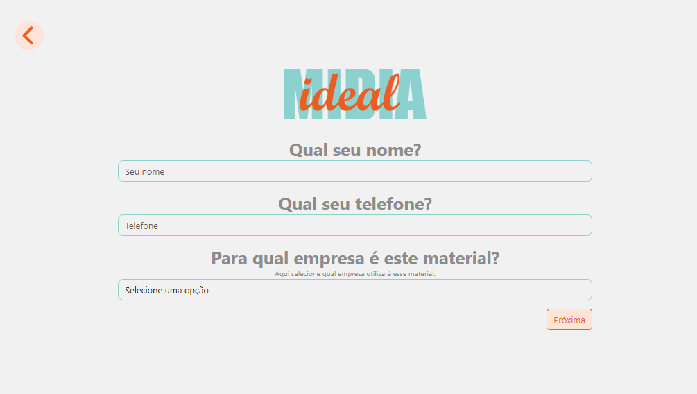
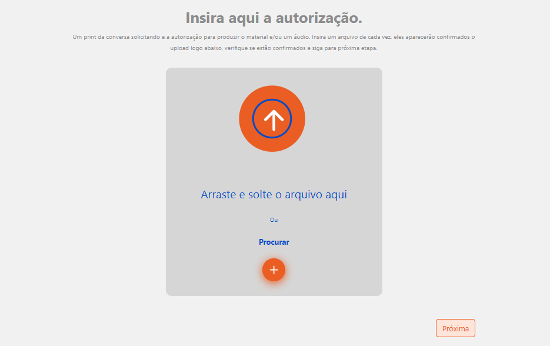
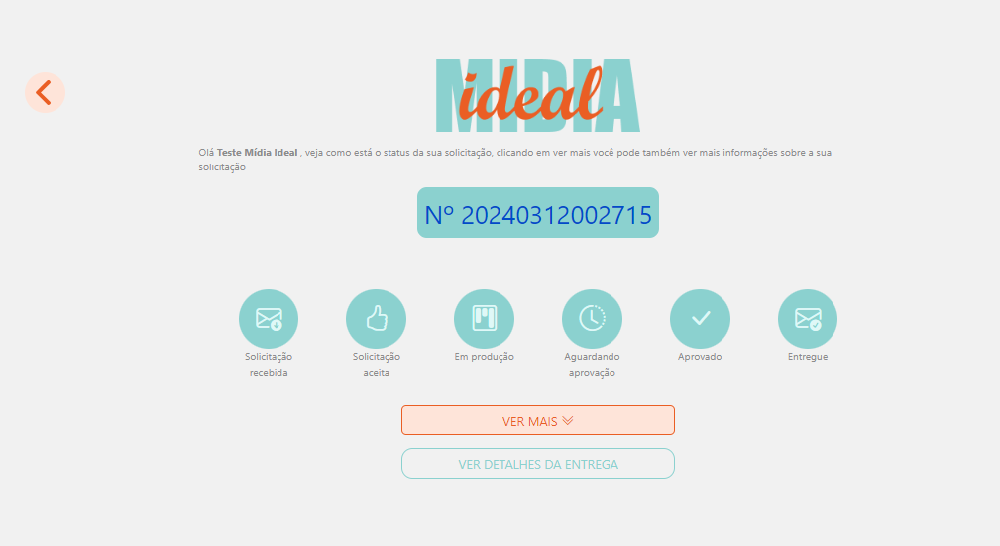

<h1 align="center"> Gerenciador de demandas - Midia Ideal </h1>

Uso exclusivo e restrito a empresa Mídia Ideal  

  <a href="#-tecnologias">Tecnologias</a>&nbsp;&nbsp;&nbsp;|&nbsp;&nbsp;&nbsp;
  <a href="#-projeto">Projeto</a>&nbsp;&nbsp;&nbsp;|&nbsp;&nbsp;&nbsp;
  <a href="#memo-licença">Licença</a>&nbsp;&nbsp;&nbsp;|&nbsp;&nbsp;&nbsp;

  

 

  

## 🚀 Tecnologias

Esse projeto foi desenvolvido com as seguintes tecnologias:

- Node.JS
- HTML e CSS
- Bootstrap
- JavaScript
- Banco de dados MySQL
- Figma

## 💻 Projeto

O Gerenciador de Demandas é um projeto que veio solucionar e trazer maior agilidade na tratativa de demandas solicitadas por todas as empresas do grupo para agência de marketing inhouse, através dele as empresas podem fazer solicitações de materiais de Marketing, desde materiais impressos a digitais, como flyers, banners, LP's e outros.

O sistema possui um formulário dinâmico de etapas, onde é preenchdi um briefing completo com todas as informações de que a agência precisa para iniciar com o desenvolvimento da demanda, ao final da geração da demanda o usuário(cliente) recebe um número de solicitação para acompanhar o status da mesma, com uma página exclusiva para visualizar os detalhes da demanda solicitada e acompanhar seu status, além de quando entregue poder solicitar aterações através desse acesso pelo número da solicitação.

No acesso restrito, o time recebe todos os detalhes da solicitação, com possibilidade de alimentar opções como data de entrega, motivo da recusa, link de entrega do material, além claro de alterar os status para Em Produção, em Aprovação, Entregue, entre outros de acordo com o fluxo de funcionamento da agência.

<a href="#-tecnologias">Aqui,</a> você pode visualizar a página inicial(formulario) de solicitação

## 📝 Licença

USO COM RESTRIÇÕES!

Esse projeto é de propriedade exclusiva da Mídia Ideal.
Entretando o uso da lógica e funcionalidade desde que não utilize a identidade visual é livre.

---

## 🤝 TIME

Feito por [Pablo Petelak 👽](https://pablopetelak.com) enquanto DEV - FullStack da [Mídia Ideal](https://midiaideal.com.br) 

## 🖥 TELAS

<ol> 
    <li>Início do formuláro (Preenchimento de detalhes pessoaise empresa) 
     
     
        

            
        

    </li>
    <li>Tela de Upload de autorização em caso de material impresso
     
     
        

            
        

    </li>
    <li>Tela de envio de informações e processamento no backend
     
     
        

            
        

    </li>
    <li>Solicitação enviada com sucesso tela com número de solicitação
     
     
        

            
        

    </li>
    <li>Tela de Pesquisa de status de solicitação
     
     
        

            
        

    </li>
    <li>Dashboard de alteração de status e demandas enviadas
     
     
        

            
        

    </li>
</ol>